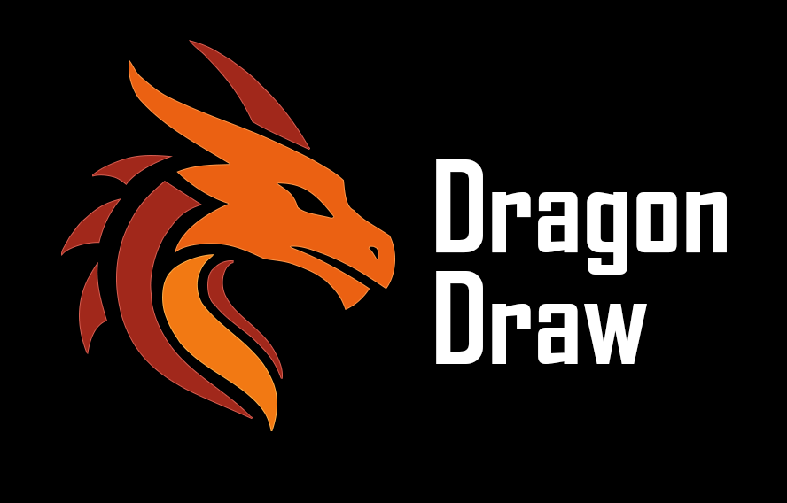

# DragonDraw

## What is this?

DragonDraw is **an idea repo.**  
Not a finished product, not a Photoshop clone, not another "one-day" promise. It's a space to sketch out what a truly programmable, code-native creative tool *could* look like.  

Think of it as Photoshop, Krita, and After Effects getting raided by ShaderToy, Strudel, and Stable Diffusion, then stitched together with code, plugins, and imagination.  

---

## Core Concepts

- **Code-native brushes & tools**  
  - Write GLSL, TypeScript, or plugins to define how a brush paints.  
  - Brushes can rasterize pixels, generate geometry, or run shaders.  

- **Geometry + Raster in one canvas**  
  - Draw splines, extrude ropes, generate meshes, right next to raster layers.  
  - Photoshop can't: DragonDraw can.  

- **Timeline & Animation**  
  - Keyframes on any parameter.  
  - Export GIFs, sprite sheets, or videos.  

- **AI as a first-class citizen**  
  - Flux, Stable Diffusion, inpainting, texture fills, all via a dead-simple API.  
  - AI isn't the app, it's just another brush.  

- **Community-first**  
  - Share snippets like Strudel or Hydra.  
  - Remix, hack, and trade plugins.  